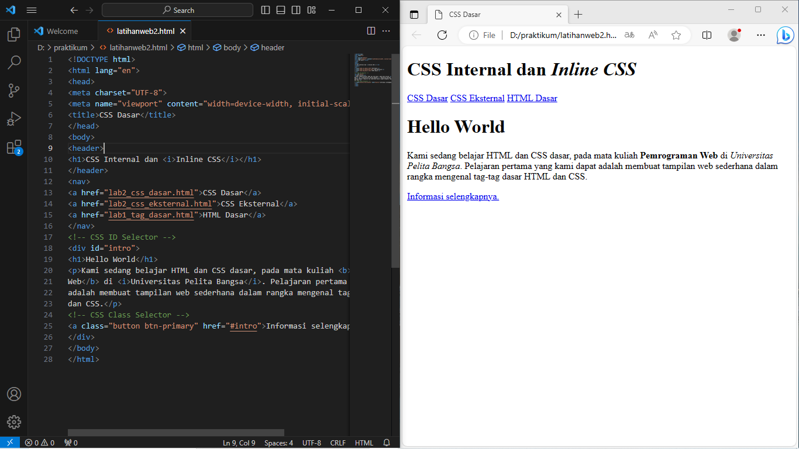
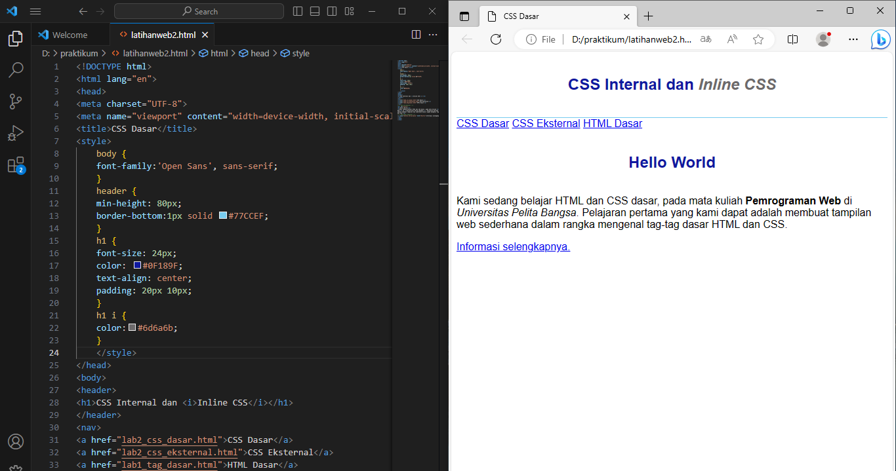
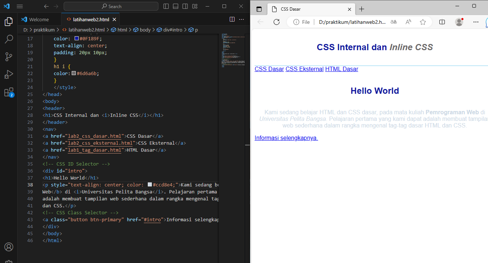
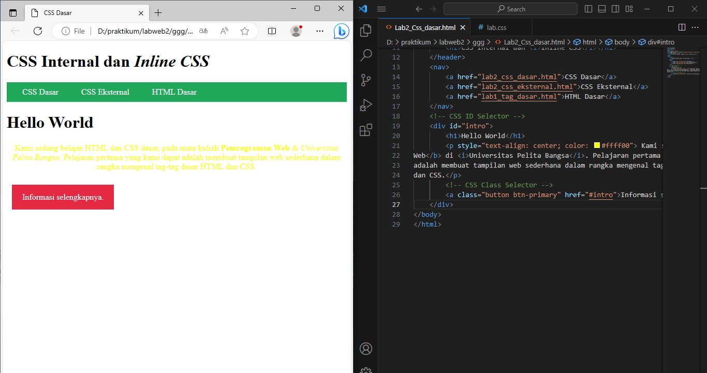
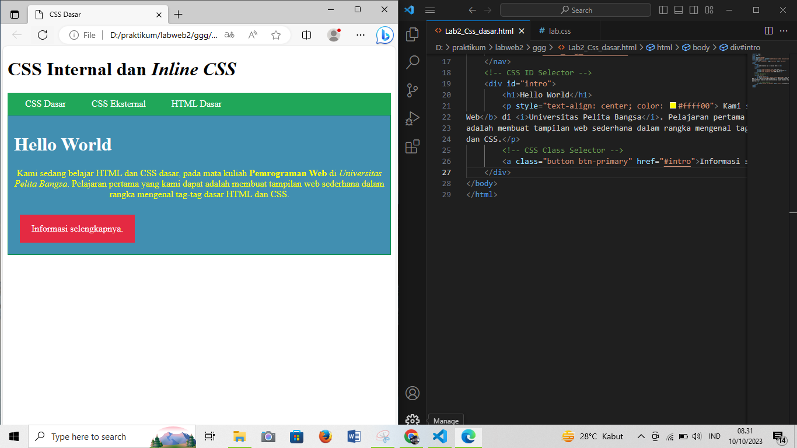
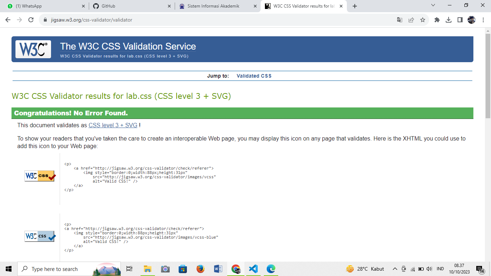

### praktikum 2 "CSS Dasar"

```
Muhammad Ryamizard R S 
TI.22.A2
```
### Praktikum

#### 1. Membuat Dokumen HTML Sebagai Berikut



#### 2. Mendeklarasi Internal CSS 

Mendeklarasi CSS di dalam html itu sendiri



#### 3. menambahkan Inline CSS

Tambahkan Inline CSS pada paragraf dengan perintah style |text align|Color untuk mengubah rata text dan warna text


#### 4. Membuat external CSS

1. Buat File baru dengan nama Lab.css 
2. kemudian kaitkan css ke html dengan tag link di bagian head



#### 5. Menambahkan CSS selektor



#### 6. Validasi File CSS di web W3C CSS



### Jawab pertanyaan dan Tugas

1. Lakukan Experimen dengan mengubah dan menambah dan nilai pada kode css mengacu pada CSS Cheat Sheet.


2. Apa Perbedaan CSS elemen h1{..} dengan #intro h1{...}?
```
jawab : #Intro disini Berfungsi sebagai Id pada Html.
Karen kita menggunakan lebih dari satu h1 maka kita buatkan id untuk membedakannya.
maka jika di css kita tidak memberikan selektor #intro yang akan terkena dampaknya
adalah heading1 yang paling atas.

```

3. Apabila ada deklarasi CSS secara internal, lali ditambahkan CSS external dan inline Css pada elemen yang sama. Deklarasi manakah yang akan ditampilkan pada browser? Berikan penjelasan dan contohnya

```
jawab: yang akan muncul adalah inline css karena ia menjadi prioritas
pertama dalam tata aturan css diurutan kedua akan muncul internal css jika ada
perintah berbedan dan di ikuti external css
```

seperti pada gambar berikut perintah yang muncul adalah inline text

4. Pada sebuah elemen HTML terdapat ID dan Class, apabila masing masing selektor tersebut terdapat CSS, maka deklarasi manakan yang akan ditampilkan oleh browser? berikan penjelasan dan contohnya!

```
jawab :yang muncul adalah Id karena dalam prinsip priority dalan css id akan di dahulukan ketimbang class
```
